# React Jobly (Assignment Instructions)

## [**Table of Contents**](#table-of-contents)

- [React Jobly (Assignment Instructions)](#react-jobly-assignment-instructions)
  - [**Table of Contents**](#table-of-contents)
  - [**Step Zero: Setup**](#step-zero-setup)
    - [Database Setup Instructions (my notes)](#database-setup-instructions-my-notes)
  - [**Step One: Design Component Hierarchy**](#step-one-design-component-hierarchy)
    - [design notes](#design-notes)
      - [App Component (wrapper)](#app-component-wrapper)
      - [NavBar Component (Unauthenticated)](#navbar-component-unauthenticated)
      - [NavBar Component (Authenticated)](#navbar-component-authenticated)
      - [Homepage Page (Unauthenticated)](#homepage-page-unauthenticated)
      - [Homepage Page (Authenticated)](#homepage-page-authenticated)
      - [Login Page](#login-page)
      - [Sign Up Page](#sign-up-page)
      - [Companies List Page](#companies-list-page)
      - [Company A Job List Page](#company-a-job-list-page)
      - [Jobs List Page](#jobs-list-page)
      - [Profile Page](#profile-page)
  - [**Step Two: Make an API Helper**](#step-two-make-an-api-helper)
  - [**Step Three: Make Your Routes File**](#step-three-make-your-routes-file)
  - [**Step Four: Companies \& Company Detail**](#step-four-companies--company-detail)
  - [**Step Five: Jobs**](#step-five-jobs)
  - [**Step Six: Current User**](#step-six-current-user)
    - [Click on the \> for a hint!](#click-on-the--for-a-hint)
  - [**Step Seven: Using localStorage and Protecting Routes**](#step-seven-using-localstorage-and-protecting-routes)
    - [**Protecting Routes**](#protecting-routes)
  - [**Step Eight: Profile Page**](#step-eight-profile-page)
  - [**Step Nine: Job Applications**](#step-nine-job-applications)
  - [**Step Ten: Deploy your Application**](#step-ten-deploy-your-application)
    - [**Render Deploy**](#render-deploy)
  - [**The Database ( for ElephantSQL)**](#the-database--for-elephantsql)
  - [**The Database (for Supabase)**](#the-database-for-supabase)
  - [**Transferring data from the existing Jobly database to Supabase**](#transferring-data-from-the-existing-jobly-database-to-supabase)
  - [**Deployment on Render**](#deployment-on-render)
    - [**Backend, First!**](#backend-first)
    - [**Front End**](#front-end)
  - [**Solution**](#solution)

[react-jobly.zip](https://s3-us-west-2.amazonaws.com/secure.notion-static.com/11cac549-9498-4718-a268-fb6a38f2a67d/react-jobly.zip)

**In this sprint, you’ll create a React front end for the Jobly backend.**

## **Step Zero: Setup**

- **The backend for this will be our solution to the *express-jobly* exercise.** You can find this in the starter code linked above.
  **Use this** instead of the backend you built for jobly — ours is feature-complete with what the front-end will need.
- Re-create the **_jobly_** database from the backend solution using the **_jobly.sql_** file.
  **Note:** even if you have a jobly database from previously, you’ll find it helpful to replace it with ours — we have lots of sample data, which will help you test the app.

---

### Database Setup Instructions (my notes)

1. To set up the databases using the jobly.sql file, follow these steps:

- [x] Open your terminal in Visual Studio Code (VSC) using WSL/Ubuntu.
- [x] Ensure you have PostgreSQL installed and running. You can start PostgreSQL with the following command:

```
sudo service postgresql start
```

- [x] Navigate to the directory containing the `jobly.sql file`. For example:

```
cd path/to/your/project
```

- [x] Run the `jobly.sql` file using the `psql` command-line tool. This will execute the SQL commands in the file to set up your databases:

```
psql -U your_username -f jobly.sql
```

Remember to Replace `your_username` with your PostgreSQL username. You may be prompted to enter your password.

Follow the prompts in the terminal. Press Enter to proceed with deleting and recreating the databases or Control-C to cancel.

- [x] After completing these steps, you should have both the jobly and jobly_test databases set up with the necessary schema and initial data.

---

- [x] Create a new React project.
- [x] It may help to take a few minutes to look over the backend to remind yourself of the most important routes.
- [x] Start up the backend. We have it starting on port 3001, so you can run the React front end on 3000.

[Back to TOC](#table-of-contents)

## **Step One: Design Component Hierarchy**

It will help you first get a sense of how this app should work.

We have a demo running at [http://joelburton-jobly.surge.sh](http://joelburton-jobly.surge.sh/). Take a tour and note the features.

Please register as a new user to explore the site.

A big skill in learning React is to learn to design component hierarchies.

It can be very helpful to sketch out a hierarchy of components, especially for larger apps, like Jobly.

As an example of this kind of diagram, here’s one for a sample todo list application:


Once you’ve done this, it’s useful to think about the props and state each component will need. Deciding *where*individual state is needed is one of the most critical things to figure out.

Here’s our simple todo list application, with component state and passed props:


We’re showing these to you with diagrams, and it can be helpful to do this with pen and paper or using a whiteboard.


You can also write this out as an indented list:

```
**App**                          General page wrapper
	no props or state

	**TodoList**                   Manages todos, shows form &
		state=todos                list of todos

		**NewTodoForm**              Manages form data, submits
			state=formData           new todo to parent
			props=addTodo()

		**Todo**                     One rendered for each todo,
			props=title, descrip     pure presentational
```

Take time to diagram what components you think you’ll need in this application, and what the most important parts of state are, and where they might live.

Notice how some things are common: the appearance of a job on the company detail page is the same as on the jobs page. You should be able to re-use that component.

### design notes

(UNAUTHENTICATED)
Homepage -

- Jobly (navItem)
- Login (navItem)
- Sign Up (navItem)
- `<h1>` displaying "Jobly"
- `<p>` displaying "All the jobs in one, convenient place.
- `<button>` displaying "Log in": clicking this button directs the user to the `log_in` page which consists of:
  - `username` input
  - `password` input
  - `<button>` displaying "Submit": clicking this button with recognized credentials brings the user to the AUTHENTICATED version of the website (see below) while unrecognized credentials displays the text: "Invalid username/password"
- `<button>` displaying "Sign up": clicking this button directs the user to the `sign_up` page which consists of:
  - `username` input
  - `password` input
  - `firstName` input
  - `lastName` input
  - `email` input
  - `<button>` displaying "Submit": clicking this button with all the credentials brings the user to the AUTHENTICATED version of the website (see below) but if some fields are not filled in it displays an error message. For example, if the `lastName` input is not filled out it displays the message "instance.lastName does not meet minimum length of 1".

(AUTHENTICATED)
Homepage

- Jobly (navItem)
- Companies (navItem) - clicking on this `navItem` takes the user to the `companies_list` page.
  - Text Search Input (w/ `Submit` button)
    - note: this doesn't work.
  - Unordered List of `companies`
    - note: each `company` is contained in a clickable `div` that contains `company_name` and a placeholder `description`. Some have images but most don't.
    - note: clicking on a `company`'s `div` takes the user to the `jobs_list` page (see below) that has:
      - `company_name` as a header followed by the same placeholder `description` as before.
      - Unordered List of `jobs`
        - note: each `job` is contained in a clickable `div` that contains `job_name`, `salary`, `equity` and an `APPLY` button.
          - note: when I click on the `APPLY` button the text changes to `APPLIED` and the background becomes slightly faded and the `button` element is no longer active.
- Jobs (navItem) - clicking on this `navItem` takes the user to the `jobs_list` page (same as above).
  - Text Search Input (w/ `Submit` button)
  - Unordered List of `jobs` (same notes & behavior as mentioned above)
- Profile (navItem) - clicking on this `navItem` takes the user to the `profile` page which contains the same input fields as the `sign_up` page that include the following:
  - `<h1>` element displaying "Profile"
  - `username` text input (inactive)
  - `firstName` text input (active)
  - `lastName` text input (active)
  - `email` text input (active)
  - `<button>` displaying "Save Changes"
- Log out `<username>` (navItem)

#### App Component (wrapper)

Each of the entities below represents a webpage with the exception of `App` which is the "wrapper" and does not contain any `props` or `state` logic. However, it's worth noting that there is a navigation bar that will always be present no matter which page the user is on.

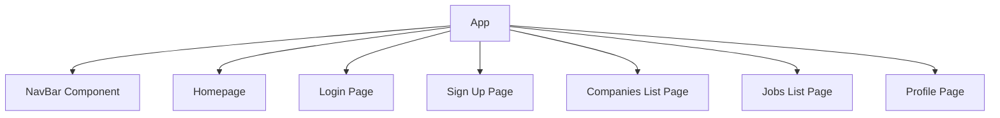

[Back to TOC](#table-of-contents)

---

#### NavBar Component (Unauthenticated)

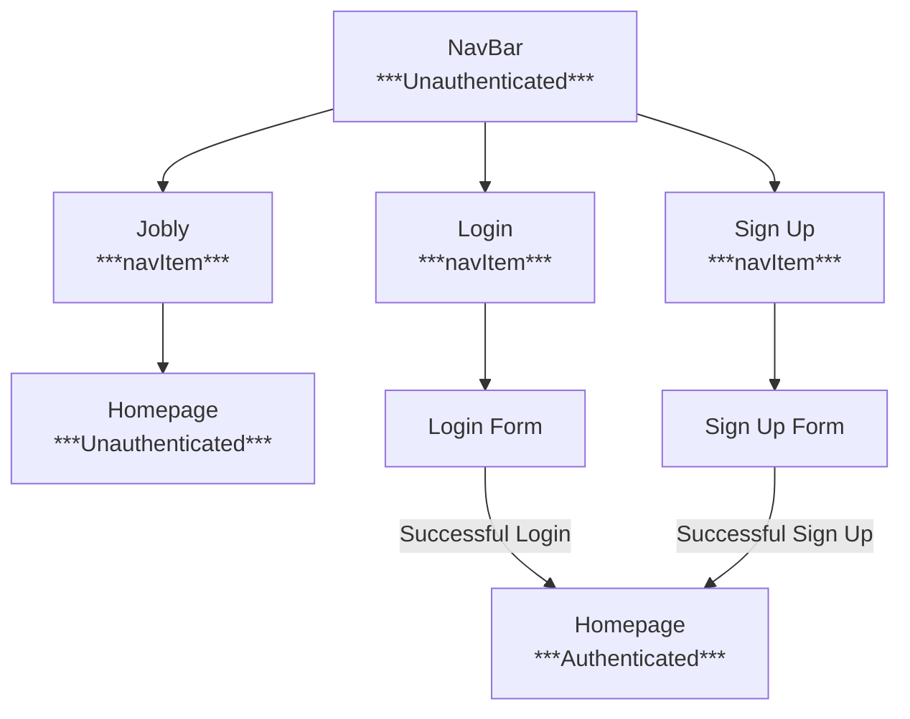

[Back to TOC](#table-of-contents)

---

#### NavBar Component (Authenticated)

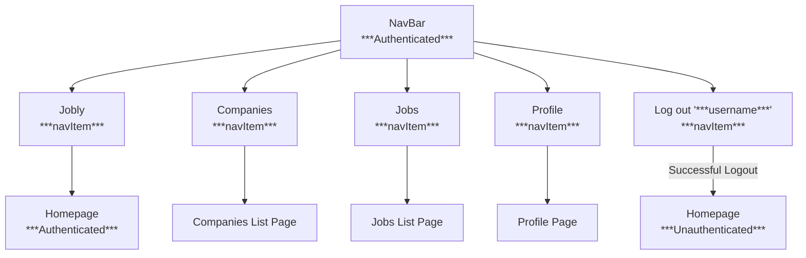

[Back to TOC](#table-of-contents)

---

#### Homepage Page (Unauthenticated)

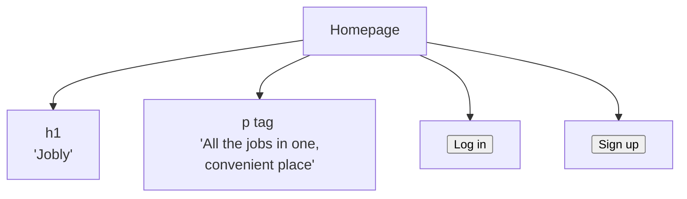

[Back to TOC](#table-of-contents)

---

#### Homepage Page (Authenticated)

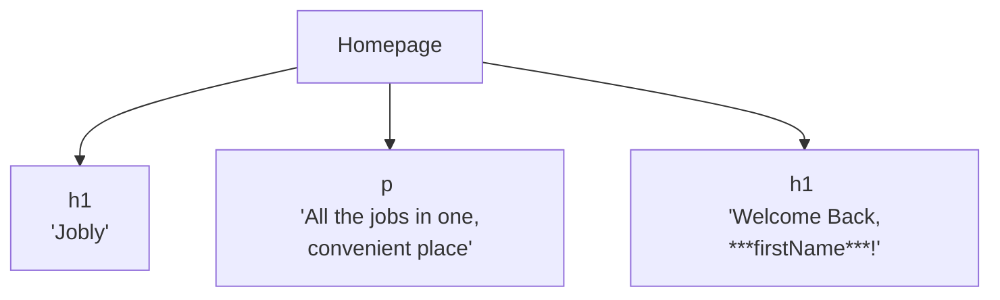

[Back to TOC](#table-of-contents)

---

#### Login Page

```mermaid
graph TD
    D[Login Page] --> T[***username*** <br> text type input field <br> <input placeholder="username">]
    D[Login Page] --> U[***password*** <br> text type input field <br> <input placeholder="password">]
    D[Login Page] --> V[<button> Submit]
```

[Back to TOC](#table-of-contents)

---

#### Sign Up Page

```mermaid
graph TD
    E[Sign Up Page] --> W[***username*** <br> text type input field <br> <input placeholder="username">]
    E[Sign Up Page] --> X[***password*** <br> text type input field <br> <input placeholder="password">]
    E[Sign Up Page] --> Y[***firstName*** <br> text type input field <input placeholder="first name">]
    E[Sign Up Page] --> Z[***lastName*** <br> text type input field <input placeholder="last name">]
    E[Sign Up Page] --> AA[***email*** <br> text type input field <input placeholder="email">]
    E[Sign Up Page] --> AB[<button> Submit]
```

[Back to TOC](#table-of-contents)

---

#### Companies List Page

```mermaid
graph TD
    F[Companies List Page] --> AC[***company_name*** <br> text type input field <input type="text" placeholder="company name">]
    F[Companies List Page] --> ACC[<button> Submit]
    F[Companies List Page] --> AD[unordered list of companies]
    AD[unordered list of companies] --> AE[<li>list item</li> link to company A <br> job list page]
    AD[unordered list of companies] --> AEE[<li>list item</li> link to company B <br> job list page]
    AE[<li>list item</li> link to company A <br> job list page] --> AF[p tag <br>***company_A_name***]
    AE[<li>list item</li> link to company A <br> job list page] --> AG[p tag <br>***company_A_description***]
    AEE[<li>list item</li> link to company B <br> job list page] --> AFF[p tag <br>***company_B_name***]
    AEE[<li>list item</li> link to company B <br> job list page] --> AGG[p tag <br>***company_B_description***]

```

[Back to TOC](#table-of-contents)

---

#### Company A Job List Page

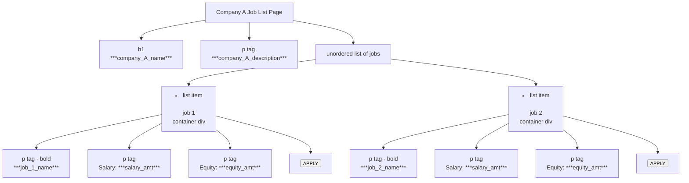

[Back to TOC](#table-of-contents)

---

#### Jobs List Page

```mermaid
graph TD
    G[Jobs List Page] --> AH[Text Search Input <br> <input placeholder="job name">]
    G[Jobs List Page] --> ACC[<button> Submit]
    G[Jobs List Page] --> AI[unordered list of jobs]
    AI[unordered list of jobs] --> AJ[ <li>job 1</li> <br> container div]
    AI[unordered list of jobs] --> AJJ[<li>job 2</li> <br> container div]
    AJ[ <li>job 1</li> <br> container div] --> AK[p tag - bold <br> ***job_1_name***]
    AJ[ <li>job 1</li> <br> container div] --> AO[p tag <br> ***company_A_name***]
    AJ[ <li>job 1</li> <br> container div] --> AL[p tag <br> Salary: ***salary_amt***]
    AJ[ <li>job 1</li> <br> container div] --> AM[p tag <br> Equity: ***equity_amt***]
    AJ[ <li>job 1</li> <br> container div] --> AN[<button> APPLY]
    AJJ[<li>job 2</li> <br> container div] --> AKK[p tag - bold <br> ***job_2_name***]
    AJJ[<li>job 2</li> <br> container div] --> AOO[p tag <br> ***company_B_name***]
    AJJ[<li>job 2</li> <br> container div] --> ALL[p tag <br> Salary: ***salary_amt***]
    AJJ[<li>job 2</li> <br> container div] --> AMM[p tag <br> Equity: ***equity_amt***]
    AJJ[<li>job 2</li> <br> container div] --> ANN[<button> APPLY]
```

[Back to TOC](#table-of-contents)

---

#### Profile Page

```mermaid
graph TD
    H[Profile Page] --> AO[h1 <br> 'Profile']
    H[Profile Page] --> AP[***username*** <br> disabled text type input field <br> <input placeholder="username" disabled>]
    H[Profile Page] --> AQ[***firstName*** <br> text type input field <br> <input placeholder="first name">]
    H[Profile Page] --> AR[***lastName*** <br> text type input field <br> <input placeholder="last name">]
    H[Profile Page] --> AS[***email*** <br> text type input field <br> <input placeholder="email">]
    H[Profile Page] --> AT[<button> Save Changes]
```

---

**Spend time here.** This may be one of the most important parts of this exercise.

[Back to TOC](#table-of-contents)

## **Step Two: Make an API Helper**

Many of the components will need to talk to the backend (the company detail page will need to load data about the company, for example).

It will be messy and hard to debug if these components all had AJAX calls buried inside of them.

Instead, make a single **_JoblyAPI_** class, which will have helper methods for centralizing this information. This is conceptually similar to having a model class to interact with the database, instead of having SQL scattered all over your routes.

Here’s a starting point for this file:

_api.js_

```jsx
import axios from "axios";

const BASE_URL = process.env.REACT_APP_BASE_URL || "http://localhost:3001";

/** API Class.
 *
 * Static class tying together methods used to get/send to to the API.
 * There shouldn't be any frontend-specific stuff here, and there shouldn't
 * be any API-aware stuff elsewhere in the frontend.
 *
 */

class JoblyApi {
  // the token for interactive with the API will be stored here.
  static token;

  static async request(endpoint, data = {}, method = "get") {
    console.debug("API Call:", endpoint, data, method);

    //there are multiple ways to pass an authorization token, this is how you pass it in the header.
    //this has been provided to show you another way to pass the token. you are only expected to read this code for this project.
    const url = `${BASE_URL}/${endpoint}`;
    const headers = { Authorization: `Bearer ${JoblyApi.token}` };
    const params = method === "get" ? data : {};

    try {
      return (await axios({ url, method, data, params, headers })).data;
    } catch (err) {
      console.error("API Error:", err.response);
      let message = err.response.data.error.message;
      throw Array.isArray(message) ? message : [message];
    }
  }

  // Individual API routes

  /** Get details on a company by handle. */

  static async getCompany(handle) {
    let res = await this.request(`companies/${handle}`);
    return res.company;
  }

  // obviously, you'll add a lot here ...
}

// for now, put token ("testuser" / "password" on class)
JoblyApi.token =
  "eyJhbGciOiJIUzI1NiIsInR5cCI6IkpXVCJ9.eyJ1c2VybmFtZ" +
  "SI6InRlc3R1c2VyIiwiaXNBZG1pbiI6ZmFsc2UsImlhdCI6MTU5ODE1OTI1OX0." +
  "FtrMwBQwe6Ue-glIFgz_Nf8XxRT2YecFCiSpYL0fCXc";
```

You won’t build authentication into the front end for a while—but the backend needs a token to make almost all API calls. Therefore, for now, we’ve hard-coded a token in here for the user “testuser”, who is also in the sample data.

(Later, once you start working on the login form, you may find it useful to log in as “testuser”. Their password is “password”).

You can see a sample API call — to **_getCompany(handle)_**. As you work on features in the front end that need to use backend APIs, add to this class.

[Back to TOC](#table-of-contents)

## **Step Three: Make Your Routes File**

Look at the working demo to see the routes you’ll need:

**_/ :_** Homepage — just a simple welcome message

**_/companies :_** List all companies

**_/companies/apple :_** View details of this company

**_/jobs :_** List all jobs

**_/login :_** Login/signup

**_/signup :_** Signup form

**_/profile :_** Edit profile page

Make your routes file that allows you to navigate a skeleton of your site. Make simple placeholder components for each of the feature areas.

Make a navigation component to be the top-of-window navigation bar, linking to these different sections.

When you work on authentication later, you need to add more things here. But for now, you should be able to browse around the site and see your placeholder components.

[Back to TOC](#table-of-contents)

## **Step Four: Companies & Company Detail**

Flesh out your components for showing detail on a company, showing the list of all companies, and showing simple info about a company on the list (we called these **_CompanyDetail_**, **_CompanyList_**, and **_CompanyCard_**, respectively —but you might have used different names).

Make your companies list have a search box, which filters companies to those matching the search (remember: there’s a backend endpoint for this!). Do this filtering in the backend — **not** by loading all companies and filtering in the front end!

[Back to TOC](#table-of-contents)

## **Step Five: Jobs**

Similarly, flesh out the page that lists all jobs, and the “job card”, which shows info on a single job. You can use this component on both the list-all-jobs page as well as the show-detail-on-a-company page.

Don’t worry about the “apply” button for now — you’ll add that later, when there’s authentication for the app.

[Back to TOC](#table-of-contents)

## **Step Six: Current User**

This step is tricky. Go slowly and test your work carefully.

Add features where users can log in, sign up, and log out. This should use the backend routes design for authentication and registration.

When the user logs in or registers, retrieve information about that user and keep track of it somewhere easily reached elsewhere in the application.

Things to do:

- Make forms for logging in and signing up
- In the navigation, show links to the login and signup forms if a user is not currently logged in.
  If someone is logged in, show their username in the navigation, along with a way to log out.
- Have the homepage show different messages if the user is logged in or out.
- When you get a token from the login and register processes, store that token on the **_JoblyApi_** class, instead of always using the hardcoded test one. You should also store the token in state high up in your hierarchy; this will let use use an effect to watch for changes to that token to kick off a process of loading the information about the new user.

Think carefully about where functionality should go, and keep your components as simple as you can. For example, in the **_LoginForm_** component, its better design that this doesn’t handle directly all of the parts of logging in (authenticating via API, managing the current user state, etc). The logic should be more centrally organized, in the **_App_** component or a specialized component.

While writing this, your server will restart often, which will make it tedious to keep typing in on the login and signup forms. A good development tip is to hardcode suitable defaults onto these forms during development; you can remove those defaults later.

[Back to TOC](#table-of-contents)

### Click on the > for a hint!

Hint on Proceeding — Read After Thinking!

Here’s the strategy we took from our solution:

- Make **_login_**, **_signup_**, and **_logout_** functions in the **_App_** component.
  By passing **_login_**, **_logout_**, and **_signup_** functions down to the login and signup forms and the navigation bar, they’ll be able to call centralized functions to perform these processes.
- Add **_token_** as a piece of state in **_App_**, along with state for the **_currentUser_**.
- Create an effect triggered by a state change of the token: this should call the backend to get information on the newly-logged-in user and store it in the **_currentUser_** state. You will need to decode the token and get the payload with the correct username. **Do not use the jsonwebtoken module to do this, you will encounter errors**. Instead, take a look at the **_jwt-decode_** module.
- Expose the current user throughout the app with a context provider. This will make it easy to refer to the current app in navigation, on pages, and so on.

This would be an excellent place to use **_useContext_**, so you can store the current user’s info high up in your hierarchy, like on the **_App_** component.

[Back to TOC](#table-of-contents)

## **Step Seven: Using localStorage and Protecting Routes**

If the user refreshes their page or closes the browser window, they’ll lose their token. Find a way to add **_localStorage_** to your application so instead of keeping the token in simple state, it can be stored in localStorage. This way, when the page is loaded, it can first look for it there.

Be thoughtful about your design: it’s not great design to have calls to reading and writing localStorage spread around your app. Try to centralize this concern somewhere.

As a bonus, you can write a generalized **_useLocalStorage_** hook, rather than writing this tied specifically to keeping track of the token.

[Back to TOC](#table-of-contents)

### **Protecting Routes**

Once React knows whether or not there’s a current user, you can start protecting certain views! Next, make sure that on the front-end, you need to be logged in if you want to access the companies page, the jobs page, or a company details page.

[Back to TOC](#table-of-contents)

## **Step Eight: Profile Page**

Add a feature where the logged-in user can edit their profile. Make sure that when a user saves changes here, those are reflected elsewhere in the app.

[Back to TOC](#table-of-contents)

## **Step Nine: Job Applications**

A user should be able to apply for jobs (there’s already a backend endpoint for this!).

On the job info (both on the jobs page, as well as the company detail page), add a button to apply for a job. This should change if this is a job the user has already applied to.

[Back to TOC](#table-of-contents)

## **Step Ten: Deploy your Application**

We’re going to use Render to deploy our backend and frontend! Before you continue, make sure you have two folders, each with their own git repository (and make sure you do not have one inside of another!)

Your folder structure might look something like this

```jsx
jobly - backend;
jobly - frontend;
```

It’s important to have this structure because we need two different deployments, one for the front-end and one for the backend.

[Back to TOC](#table-of-contents)

### **Render Deploy**

(Flask version here [https://lessons.springboard.com/Flask-Python-Deployment-with-Render-86d8c634de0b4ee6a74286e91f4c9aca](https://lessons.springboard.com/86d8c634de0b4ee6a74286e91f4c9aca?pvs=21))

Ensure the app works without error on your local computer.

[Back to TOC](#table-of-contents)

## **The Database ( for ElephantSQL)**

You must have created and seeded the db on your computer. This should be part of making sure the app works locally.

1. Create account at [ElephantSQL](https://www.elephantsql.com/) using GitHub
2. Create a “Tiny Turtle” (free) instance
3. Select region: _US-West-1_ _(even if others are closer to you)_
4. If you get an error selecting _US-West-1_, pick _US-East-1_
5. Any unique name will do
6. Plan should be Tiny Turtle (Free)
7. Confirm and create
8. Click on your new instance and copy the URL

Back in your terminal seed the db with

```jsx
*pg_dump -O jobly | psql (url you copied here)*
```

Check on your database with:

```jsx
*psql (url you copied here)*
```

[Back to TOC](#table-of-contents)

## **The Database (for Supabase)**

You should already have an account at **Supabase** but you can create a new one if needed

1. Create a New Project (If you are at the limit of 2 active projects, you can **PAUSE** one)
2. Select region: **Supabase** will choose one for you, but you may select one closest to you
3. Create a **strong** database password or let **Supabase** generate one for you automatically
4. Wait for the project to be created, then navigate to: ‘Project Settings’ > ‘Configuration’ > ‘Database’

[Back to TOC](#table-of-contents)

## **Transferring data from the existing Jobly database to Supabase**

To transfer your existing **Jobly** database INCLUDING any data that you may have created, you can use the **<pg_dump>** command along with **<psql>:**

1. Grab the PSQL connection string from Supabase

_Example may look something like this:_

_“psql -h aws-0-us-east-1.pooler.supabase.com -p 5432 -d postgres -U postgres.wmytcyirfgszxtvlxsbg”_

1. Open up the terminal and initialize **<pg_dump>**

_Example:_

```jsx
**pg_dump -O jobly | psql -h** aws-0-us-east-1.pooler.supabase.com **-p** 5432 **-d** postgres **-U** postgres.wmytcyirfgszxtvlxsbg
```

_(IMPORTANT: The connection options will be different for every user, the values in RED are for demonstration purposes only and will be different in your database instance._

1. PSQL will connect to your **Supabase** database and prompt you for your password, enter your **Supabase** database password and wait for the copy process to finish

_This dumps your existing **Jobly** database and loads it in your new database hosted on Supabase. If you are deploying a different application such as your capstone, you will need to update the previous line of code._

_Your local Database on your machine HAS to be named “jobly” for the command above to work properly, if it is named something else, alter the command accordingly._

[Back to TOC](#table-of-contents)

## **Deployment on Render**

- A service for serving web applications from the cloud
- Similar to Salesforce’s Heroku product, but has a free tier

[Back to TOC](#table-of-contents)

### **Backend, First!**

At User Dashboard choose **New Web Service**. Build and deploy from git repository(If none of your repos are appearing click on Configure Account and make sure you’ve linked the proper Github account to Render). Choose your Jobly backend repository.

You can name it anything you want, but keep in mind that future employers may look at this.

- Choose Oregon (US West)

You should not need to change any other entries, but they should be:

- Node → npm install → node server.js
- Choose free

You will need to make three environment variables.

| SECRET_KEY   | The value can be any string you want.               |
| ------------ | --------------------------------------------------- |
| NODE_ENV     | Must be the string "production"                     |
| DATABASE_URL | Copy and paste the url from your Supabase database. |

You will be taken to the logs screen of your back end. You should see it compile and deploy.

**There will be two 404 errors.**

- One is trying to go to the / directory of the backend. It does not have one.
- The other is trying to load a favicon. Unless you add one, you don’t have one and you can ignore both errors.

To test your backend go to the url listed towards the top of the web service page, just under the name for the app and the GitHub address.Copy that url into your browser and add companies at the end like so:https://myjoblyprojectname.onrender.com/companies

Copy and save the url for later use in the front end setup.

[Back to TOC](#table-of-contents)

### **Front End**

1. From your Render top nav bar choose New +
2. Choose Static Site
3. Build and deploy from a Git repository
4. Choose your jobly front end repository
5. Choose Oregon (US West). You should not need to change the other entries.
6. Instance Type choose free.You will need to add an Environment Variable

| REACT_APP_BASE_URL        | Copy and paste the url from the Render back end. |
| ------------------------- | ------------------------------------------------ |
| NODE_ENV                  | Must be the string "production"NODE_VERSION      |
| Must be the value 16.20.0 |

Once it is deployed you should go to the url given towards the top of the dashboard. It may be a bit slow the first time it is used. You can also check the logs of your backend to see if it’s been contacted.

[Back to TOC](#table-of-contents)

## **Solution**

[View our solution](http://curric.rithmschool.com/springboard/exercises/react-jobly/solution)

[Back to TOC](#table-of-contents)
